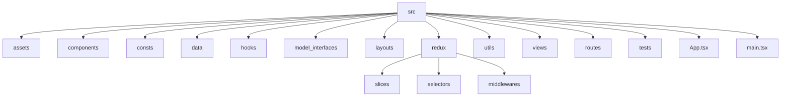

# AI Legal Vite

Proyecto base con Vite, React, Redux Toolkit y Vitest.

---

## 🚀 Instalación

Este proyecto recomienda el uso de **pnpm** como gestor de paquetes por las siguientes razones:

- Es mucho más rápido en instalaciones, especialmente en proyectos grandes.
- Usa enlaces simbólicos para ahorrar espacio en disco (no duplica dependencias).
- Es totalmente compatible con los comandos de `npm` y `yarn`.
- Es cada vez más adoptado en proyectos modernos por su eficiencia.

Puedes usar igualmente `npm` o `yarn` si lo prefieres.

```sh
pnpm install # o npm install / yarn install
```

## 📦 Scripts útiles

- `pnpm dev` - Servidor de desarrollo
- `pnpm build` - Build de producción
- `pnpm preview` - Previsualización de build
- `pnpm lint` - Linting del código
- `pnpm test` - Ejecuta los tests con Vitest
- `pnpm type-check` - Verifica los tipos TypeScript

---

## 📁 Estructura recomendada y escalable

```text
src/
  assets/              # Imágenes, fuentes, estilos globales
  components/          # Componentes reutilizables (botones, modales, etc)
  consts/              # Constantes globales, enums, configuraciones
  data/                # Datos mock, fixtures, archivos JSON
  hooks/               # Custom hooks de React
  model_interfaces/    # Tipos e interfaces TypeScript
  layouts/             # Componentes de layout reutilizables (estructura de página)
  redux/               # Slices, store, sagas, middlewares
    store.ts
    rootReducer.ts
    rootSaga.ts
    slices/
    selectors/
    middlewares/
  utils/               # Helpers y utilidades
  views/               # Vistas principales (Dashboard, Login, etc)
  routes/              # Definición de rutas y navegación
  tests/               # Tests unitarios y de integración (Vitest)
  App.tsx
  main.tsx
```

### Diagrama de carpetas



---

## 🧩 Recomendaciones para escalabilidad

- **Separar lógica de negocio y presentación**: Mantén los componentes lo más puros posible, delegando la lógica a hooks, redux o utils.
- **Redux Toolkit**: Usa slices para cada dominio de negocio. Centraliza la configuración en `store.ts` y usa middlewares para lógica avanzada (ej: sagas).
- **Tests**: Ubica los tests junto a los archivos que prueban o en `src/tests` para integración.
- **Rutas**: Centraliza la definición de rutas en `src/routes`.
- **Tipado**: Usa interfaces y tipos en `model_interfaces` para mantener el tipado fuerte en todo el proyecto.
- **Convenciones de nombres**: Usa PascalCase para componentes y camelCase para funciones y variables.

---

## 📂 Descripción de carpetas

- **assets**: Imágenes, logos, fuentes y estilos globales.
- **components**: Componentes reutilizables como botones, inputs, cards, modales, etc.
- **consts**: Constantes globales, enums y configuraciones generales.
- **data**: Datos mock, archivos JSON o fixtures para pruebas y desarrollo.
- **hooks**: Custom hooks de React para lógica reutilizable.
- **model_interfaces**: Interfaces y tipos TypeScript para props, formularios y modelos de datos.
- **layouts**: Componentes de layout reutilizables para estructurar páginas (por ejemplo, layouts de dashboard, auth, etc).
- **redux**: Slices, store, thunks y llamadas a APIs si usas Redux Toolkit.
- **utils**: Funciones auxiliares y helpers (formateo, validaciones, estilos particulares como función, etc).
- **views**: Vistas principales de la aplicación (Dashboard, Login, Register, Home, etc).
- **routes**: Definición de rutas y navegación.
- **tests**: Pruebas unitarias y de integración.

## Uso Devcontainer

## Implementación de AXIOS

- **ApiFactory.ts**: Patrón Singleton/Factory.
- **ErrorHandler.ts**: Manejo centralizado de errores.
- **vite-env.d.ts**: Tipado para variables de entorno.
- **Ejemplos de uso**: Documentación práctica.

## Plan de Implementación

### 📋 Pasos Manuales para Implementar las Mejoras

#### **PASO 1: Verificar configuración de entorno**

Primero, asegúrate de que las variables de entorno estén correctamente configuradas:

```bash
# Verificar que las variables de entorno estén configuradas
echo "VITE_API_URL=${VITE_API_URL}"
```

Verifica que el archivo `.env` contenga:

```properties
VITE_API_URL = https://tu-api-url.com/
```

#### **PASO 2:**

1. **Utilizar ApiFactory - getServices()**:

   ```typescript
   import ApiFactory from './api/ApiFactory'
   const services = ApiFactory.getServices()
   ```

2. **Actualizar manejo de errores**:

   ```typescript
   import { ErrorHandler, ErrorTypes } from './utils/ErrorHandler'

   try {
     const response = await services.get('/endpoint')
   } catch (error) {
     const appError = ErrorHandler.createError(
       ErrorTypes.NETWORK_ERROR,
       'Error al cargar datos',
       error
     )
     ErrorHandler.logError(appError)
     const userMessage = ErrorHandler.getUserFriendlyMessage(appError)
   }
   ```

3. **Utilizar ApiResponse**:
   ```typescript
   const response: ApiResponse<YourDataType> = yield call(...)
   ```

#### **PASO 4: Redux Actions / En caso de almacenaje global**

```typescript
yield put({ type: LOG_IN_SUCCESS, payload: logginResponse })
```

Implementar los reducers correspondientes:

```typescript
// En el reducer:
case LOG_IN_SUCCESS:
  return {
    ...state,
    isAuthenticated: true,
    user: action.payload.data,
    loading: false
  }
```

#### **PASO 5: Implementar en componentes React**

Ejemplo de uso en un componente de manera clásica, sin usar SAGAS/REDUX:

```typescript
import React, { useState } from 'react'
import ApiFactory from '../api/ApiFactory'
import { ErrorHandler, ErrorTypes } from '../utils/ErrorHandler'

const LoginComponent = () => {
  const [loading, setLoading] = useState(false)
  const [error, setError] = useState<string | null>(null)

  const handleLogin = async (credentials: LoginCredentials) => {
    setLoading(true)
    setError(null)
    try {
      const services = ApiFactory.getServices()
      const response = await services.login(credentials)
      console.log('Login exitoso:', response.data)
    } catch (error) {
      const appError = ErrorHandler.createError(
        ErrorTypes.AUTH_ERROR,
        'Error de autenticación',
        error
      )
      setError(ErrorHandler.getUserFriendlyMessage(appError))
    } finally {
      setLoading(false)
    }
  }

  // Resto del componente...
}
```

## 🏗️ Beneficios de la Arquitectura

### **Principios SOLID Aplicados**

✅ **Open/Closed Principle (OCP)**:

- La arquitectura es extensible sin modificar código existente
- Nuevos tipos de autenticación pueden agregarse sin cambiar HttpClient
- Nuevos servicios pueden implementar la misma interfaz

✅ **Single Responsibility Principle (SRP)**:

- HttpClient: Solo maneja comunicación HTTP
- Services: Solo maneja lógica de negocio de API
- ErrorHandler: Solo maneja errores
- ApiFactory: Solo maneja la creación de instancias

### **Patrones de Diseño Implementados**

🏭 **Factory Pattern**: ApiFactory centraliza la creación de servicios
🔌 **Adapter Pattern**: HttpClient abstrae axios de la lógica de negocio
🔄 **Singleton Pattern**: Una sola instancia de HttpClient en toda la aplicación

### **Beneficios Técnicos**

#### **1. Tipado Fuerte y Seguridad**

```typescript
const response: ApiResponse<User[]> = await services.getUsers()
```

#### **2. Manejo de Errores Centralizado**

- Mensajes consistentes para el usuario
- Logging centralizado para debugging
- Fácil customización de comportamiento por tipo de error

#### **3. Interceptores Inteligentes**

- Manejo automático de tokens
- Retry automático en fallos de red
- Headers consistentes en todas las peticiones

#### **4. Configuración Centralizada**

- Un solo lugar para configurar timeouts, base URL, headers
- Fácil cambio entre ambientes (dev, staging, prod)
- Configuración de interceptores reutilizable

### **Beneficios de Mantenimiento**

📈 **Escalabilidad**: Fácil agregar nuevos endpoints y servicios
🔧 **Mantenibilidad**: Código organizado y bien separado
🐛 **Debugging**: Logs centralizados y manejo de errores consistente
🧪 **Testing**: Arquitectura que facilita unit tests y integration tests
📚 **Documentación**: Tipos TypeScript sirven como documentación viva

### **Beneficios de Desarrollo**

⚡ **Productividad**: Menos código boilerplate
🛡️ **Seguridad**: Manejo automático de tokens y headers
🎯 **Consistencia**: Misma interfaz para todas las llamadas API
🔄 **Reutilización**: Servicios reutilizables en toda la aplicación
