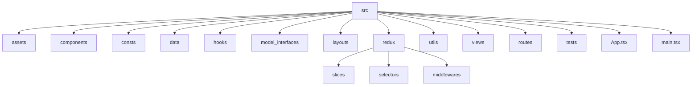

# AI LEGAL

Proyecto base con Vite, React, Redux Toolkit y Vitest.

---

## 🚀 Instalación

Este proyecto recomienda el uso de **pnpm** como gestor de paquetes por las siguientes razones:

- Es mucho más rápido en instalaciones, especialmente en proyectos grandes.
- Usa enlaces simbólicos para ahorrar espacio en disco (no duplica dependencias).
- Es totalmente compatible con los comandos de `npm` y `yarn`.
- Es cada vez más adoptado en proyectos modernos por su eficiencia.

Puedes usar igualmente `npm` o `yarn` si lo prefieres.

```sh
pnpm install # o npm install / yarn install
```

## 📦 Scripts útiles

- `pnpm dev` - Servidor de desarrollo
- `pnpm build` - Build de producción
- `pnpm preview` - Previsualización de build
- `pnpm lint` - Linting del código
- `pnpm test` - Ejecuta los tests con Vitest
- `pnpm type-check` - Verifica los tipos TypeScript

---

## 📁 Estructura recomendada y escalable

```text
src/
  assets/              # Imágenes, fuentes, estilos globales
  components/          # Componentes reutilizables (botones, modales, etc)
  consts/              # Constantes globales, enums, configuraciones
  data/                # Datos mock, fixtures, archivos JSON
  hooks/               # Custom hooks de React
  model_interfaces/    # Tipos e interfaces TypeScript
  layouts/             # Componentes de layout reutilizables (estructura de página)
  redux/               # Slices, store, sagas, middlewares
    store.ts
    rootReducer.ts
    rootSaga.ts
    slices/
    selectors/
    middlewares/
  utils/               # Helpers y utilidades
  views/               # Vistas principales (Dashboard, Login, etc)
  routes/              # Definición de rutas y navegación
  tests/               # Tests unitarios y de integración (Vitest)
  App.tsx
  main.tsx
```

### Diagrama de carpetas



---

## 🧩 Recomendaciones para escalabilidad

- **Separar lógica de negocio y presentación**: Mantén los componentes lo más puros posible, delegando la lógica a hooks, redux o utils.
- **Redux Toolkit**: Usa slices para cada dominio de negocio. Centraliza la configuración en `store.ts` y usa middlewares para lógica avanzada (ej: sagas).
- **Tests**: Ubica los tests junto a los archivos que prueban o en `src/tests` para integración.
- **Rutas**: Centraliza la definición de rutas en `src/routes`.
- **Tipado**: Usa interfaces y tipos en `model_interfaces` para mantener el tipado fuerte en todo el proyecto.
- **Convenciones de nombres**: Usa PascalCase para componentes y camelCase para funciones y variables.

---

## 📂 Descripción de carpetas

- **assets**: Imágenes, logos, fuentes y estilos globales.
- **components**: Componentes reutilizables como botones, inputs, cards, modales, etc.
- **consts**: Constantes globales, enums y configuraciones generales.
- **data**: Datos mock, archivos JSON o fixtures para pruebas y desarrollo.
- **hooks**: Custom hooks de React para lógica reutilizable.
- **model_interfaces**: Interfaces y tipos TypeScript para props, formularios y modelos de datos.
- **layouts**: Componentes de layout reutilizables para estructurar páginas (por ejemplo, layouts de dashboard, auth, etc).
- **redux**: Slices, store, thunks y llamadas a APIs si usas Redux Toolkit.
- **utils**: Funciones auxiliares y helpers (formateo, validaciones, estilos particulares como función, etc).
- **views**: Vistas principales de la aplicación (Dashboard, Login, Register, Home, etc).
- **routes**: Definición de rutas y navegación.
- **tests**: Pruebas unitarias y de integración.

Este proyecto sigue las siguientes reglas de desarrollo y gestión de ramas.

## Estructura de Ramas

### 🌟 Main/Master

- **Descripción**: Almacena el historial oficial de lanzamiento. Contiene el código en producción y es la base para las versiones estables.
- **Regla**: Todos los commits deben estar etiquetados con el número de versión correspondiente.

### 🔄 Develop

- **Descripción**: Sirve como la rama de integración para las características. Aquí se fusionan las ramas de características (feature) después de que las Pull Requests han sido revisadas y aprobadas.
- **Regla**: Esta rama es donde se realiza el desarrollo activo y se preparan las nuevas funcionalidades.

### 🚀 Release

- **Descripción**: Esta rama se crea desde `Develop` durante el tiempo de lanzamiento para realizar la auditoría final del código. Una vez que se ha validado, se fusiona con `Main/Master` y `Develop`.
- **Regla**: Asegura que el código esté completamente testeado y listo para producción.

### 🛠️ Hotfix

- **Descripción**: Se utiliza para corregir problemas críticos en producción. Se crea a partir de `Main/Master` y, una vez solucionado el problema, se fusiona de nuevo en ambas ramas: `Main/Master` y `Develop`.
- **Regla**: Permite realizar correcciones urgentes sin interrumpir el flujo de desarrollo.

### ✨ Feature

- **Descripción**: Estas ramas se utilizan para desarrollar nuevas características. Se crean a partir de `Develop` y, una vez que la característica está completa, se fusionan de nuevo en `Develop`.
- **Regla**: Cada nueva funcionalidad debe ser desarrollada en su propia rama de características.

### Infografía


## Contribuciones

Si deseas contribuir a este proyecto, por favor sigue las siguientes pautas:

1. Crea una nueva rama `Feature` para tu trabajo.
2. Realiza tus cambios y asegúrate de que todo funcione correctamente.
3. Abre un Pull Request hacia la rama `Develop`.

Si deseas hacer pruebas utilizando este proyecto, por favor sigue las siguientes pautas:

1. Crea una nueva rama `Feature/nombre_dev` para experimentar.
2. Experimente.
